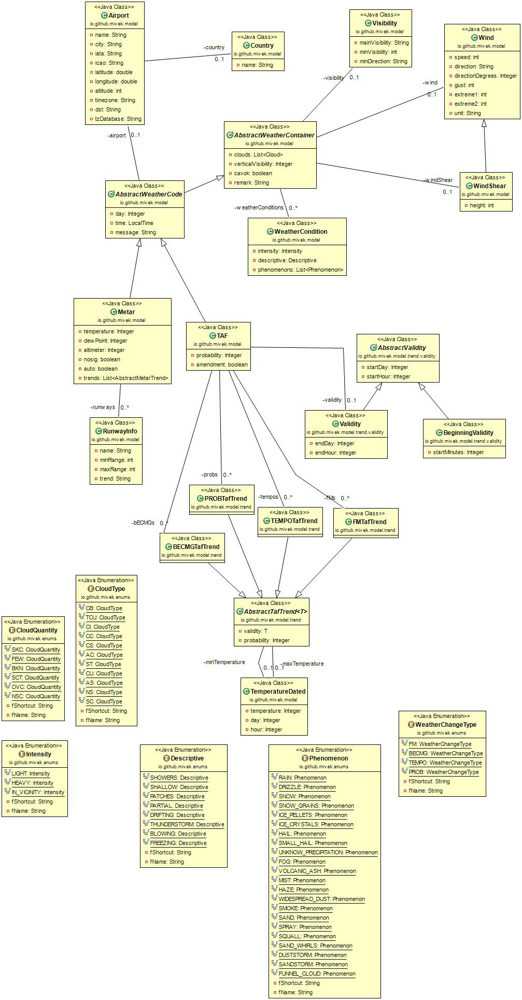
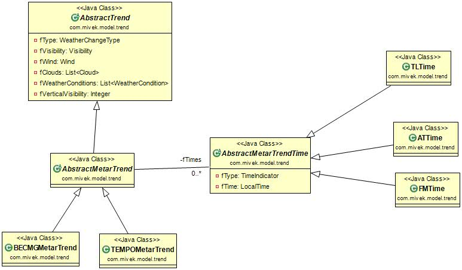

[](https://travis-ci.com/github/mivek/MetarParser)
[](https://sonarcloud.io/dashboard?id=io.github.mivek%3AmetarParser)
[](https://sonarcloud.io/dashboard?id=io.github.mivek%3AmetarParser)
[](https://github.com/mivek/MetarParser/blob/master/LICENSE)
[](https://search.maven.org/artifact/io.github.mivek/metarParser/)


# MetarParser

This java lib provides a Metar and TAF decoder.

## Table of content

1.  [Adding dependency](#adding-the-dependency)
2.  [Model](#model)
    1.  [Enumerations](#enumerations)
    2.  [Classes](#classes)
3.  [Examples](#examples)
    1.  [Parse a metar](#parse-a-metar)
    2.  [Retrieve a metar](#retrieve-the-metar-of-an-airport)
    3.  [Parse a taf](#parse-a-taf)
    4.  [Retrieve a taf](#retrieve-a-taf)
4.  [Internationalization](#internationalization)

## Architecture of the project

This project is divided into multiple maven module

-   metarParser-entities: Contains the model and the enumerations
-   metarParser-parsers: Contains the parsers and the commands
-   metarParser-services: Contains a service allowing you to parse or retrieve METAR and TAF
-   metarParser-spi: Contains the SPI 
-   metarParser-commons: Contains utility and internationalization classes

## Adding the dependency

To add the service module :

```xml
<dependency>
  <groupId>io.github.mivek</groupId>
  <artifactId>metarParser-services</artifactId>
  <version>latest</version>
</dependency>
```

Or check [here](https://search.maven.org/artifact/io.github.mivek/metarParser/) if you are not using maven.

## Model

The class diagrams are generated by IntelliJ
When updating classes, regenerate the diagrams and save the images in the project.


### Enumerations

The application contains numerous enumerations to represent data.

-   CloudType: to represent the type of cloud.
-   CloudQuantity: to represent the amount of clouds.
-   Intensity: to represent the intensity of a meteorological phenomenon.
-   Descriptive: to represent the description of a meteorological phenomenon.
-   DepositType: to represent the type of deposit on a runway.
-   DepositCoverage: to represent the percentage of the runway covered by the deposit.
-   DepositThickness: to represent the thickness of the deposit.
-   DepositBrakingCapacity: to represent the braking capacity on the runway.    
-   Phenomenon: to represent a phenomenon.
-   WeatherChangeTime: to represent a trend.
-   TimeIndicator: to represent the time of the trend.

### Classes

#### Airport

The airport class is composed of

-   Name
-   City
-   Country
-   IATA code
-   ICAO code
-   latitude
-   longitude
-   altitude
-   timezone
    Note: Depending on the source for the airports, fields can be null

#### Cloud

In this application a cloud is composed of 

-   CloudQuantity
-   CloudType (optional)
-   height (optional)

#### Country

A country is represented by its name.

#### Runway information

The runway information can represent either a visual range or a deposit.

If the object represents a visual range the field `minRange` is non null.

The runway information is composed of 

-   The name of the runway
-   The minimal visibility on the runway (optional)
-   The indicator of the visual range. Either "greater than", "less than" or empty. (optional)    
-   The maximal visibility on the runway (optional)
-   The trend of the visibility (optional)
-   The type of deposit (optional)
-   The percentage of coverage on the runway
-   The thickness of the deposit.
-   The braking capacity on the runway.

#### Visibility

The visibility class is composed of

-   The main visibility
-   The minimal visibility (optional)
-   The direction of the minimal visibility (optional)

#### WeatherCondition

The weather condition is class to represent a meteorological phenomenon.
A weather condition is composed of 

-   an intensity (optional)
-   a descriptive (optional)
-   a list of phenomenon

#### Wind

The wind class is composed of 

-   the speed
-   the direction
-   the speed of the gust
-   the minimal wind variation in degrees
-   the maximal wind variation in degrees
-   the unit of the wind's speed

#### WindShear

This class is a subclass of Wind.
It is composed of

-   the height of the wind shear.

### Trends


Numerous classes represents the trends. Trends are stored inside a list of the metar object `Metar.getTrends()`.
Trends are composed of 

-   a Type (BECMG or TEMPO)
-   a wind
-   a visibility and vertical visibility
-   a list of clouds
-   a list of weather conditions
-   a list of `AbstractMetarTrendTime` to represent the time with its type (AT, FM, TL)

## Airports loading

By default, airports are loaded from the temporary file [airport.dat](metarParser-spi/src/main/resources/data/airports.dat)
It is possible to provide your own source of airports via spi.
See [spi](metarParser-spi/README.md) module for details. 

## Examples

### Parse a metar

Instantiate the metarFacade and use its method parse.

```java
String code = "LFPG 131830Z 19005KT 170V250 9999 -SHRA FEW040TCU SCT086 16/08 Q1011";
MetarService service = MetarService.getInstance();
Metar metar = service.decode(code);
```

### Retrieve the metar of an airport

Instantiate the metarFacade.
Use the its method retrieveFromAirport with the ICAO code of the airport.

```java
String icao = "LFPG";
MetarService service = MetarService.getInstance();
Metar metar = service.retrieveFromAirport(icao);
```

### Parse a taf

Use the TAFFacade to decode the taf.

```java
String message = "TAF LFPG 150500Z 1506/1612 17005KT 6000 SCT012 \n" 
                  +"TEMPO 1506/1509 3000 BR BKN006 PROB40 \n"
                  +"TEMPO 1506/1508 0400 BCFG BKN002 PROB40 \n"
                  +"TEMPO 1512/1516 4000 -SHRA FEW030TCU BKN040 \n" 
                  +"BECMG 1520/1522 CAVOK \n"
                  +"TEMPO 1603/1608 3000 BR BKN006 PROB40 \n"
                  +"TEMPO 1604/1607 0400 BCFG BKN002 TX17/1512Z TN07/1605Z";
TAFService service = TAFService.getInstance();
TAF taf = service.decode(message);
```

Lines of the message have to be separated by a "\\n" character.

### Retrieve a taf

Use the TAFFacade and the method retrieveFromAirport with the ICAO code of the airport.

```java
String icao = "LFPG";
TAFService service = TAFService.getInstance();
TAF taf = service.retrieveFromAirport(icao);
```

### Internationalization

English and french locales are supported by the library. The library uses the user's locale.
The default locale is english.

#### Change the locale and contributing

To change the locale use the method `setLocale(Locale)` of the class `Messages.java`

```(java)
Messages.getInstance().setLocale(Locale.FRENCH); // Changes the locale to french.
```

If you are willing to add a new locale or contribute to the project please see [Contributing.md file](CONTRIBUTING.md).

[Jetbrains](https://www.jetbrains.com/?from=metarParser) open source project.
