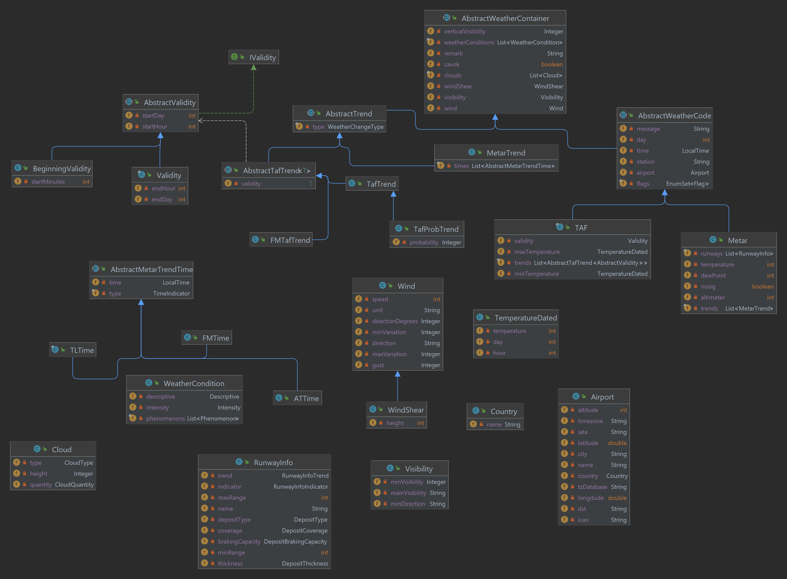

[](https://github.com/mivek/MetarParser/actions/workflows/maven-verify.yml)
[](https://github.com/mivek/MetarParser/actions/workflows/build_sonar_verify.yml)[](https://sonarcloud.io/dashboard?id=io.github.mivek%3AmetarParser)
[](https://sonarcloud.io/dashboard?id=io.github.mivek%3AmetarParser)
[](https://github.com/mivek/MetarParser/blob/main/LICENSE)
[](https://search.maven.org/artifact/io.github.mivek/metarParser/)

# MetarParser

This java lib provides a Metar and TAF decoder.

## Table of content

1.  [Adding dependency](#adding-the-dependency)
2.  [Model](#model)
    1.  [Enumerations](#enumerations)
    2.  [Classes](#classes)
3.  [Examples](#examples)
    1.  [Parse a metar](#parse-a-metar)
    2.  [Retrieve a metar](#retrieve-the-metar-of-an-airport)
    3.  [Parse a taf](#parse-a-taf)
    4.  [Retrieve a taf](#retrieve-a-taf)
4.  [Internationalization](#internationalization)

## Architecture of the project

This project is divided into multiple maven module

-   metarParser-entities: Contains the model and the enumerations
-   metarParser-parsers: Contains the parsers and the commands
-   metarParser-services: Contains a service allowing you to parse or retrieve METAR and TAF
-   metarParser-spi: Contains the SPI 
-   metarParser-commons: Contains utility and internationalization classes

## Adding the dependency

To add the service module :

```xml
<dependency>
  <groupId>io.github.mivek</groupId>
  <artifactId>metarParser-services</artifactId>
  <version>latest</version>
</dependency>
```

Or check [here](https://search.maven.org/artifact/io.github.mivek/metarParser/) if you are not using maven.

## Model

The class diagrams are generated by IntelliJ
When updating classes, regenerate the diagrams and save the images in the project.


### Enumerations

The application contains numerous enumerations to represent data.

- CloudType: Represents the type of cloud.
- CloudQuantity: Represents the amount of clouds.
- DepositCoverage: Represents the percentage of a runway covered by deposit.
- DepositType: Represents the type of deposit on a runway (NOT_REPORTED, CLEAR_DRY, DAMP, WET_WATER_PATCHES, RIME_FROST_COVERED, DRY_SNOW, WET_SNOW, SLUSH, ICE, COMPACTED_SNOW, FROZEN_RIDGES).
- Descriptive: Represents the description of a meteorological phenomenon.
- Flag: Represents a flag applied to a METAR or TAF: AMD, AUTO, CNL, COR or NIL.
- IcingIntensity: Represents the intensity of an icing element.
- Intensity: Represents the intensity of a meteorological phenomenon (LIGHT, HEAVY, RECENT, IN_VICINITY).
- Phenomenon: Represents a meteorological phenomenon (various weather phenomena like HAZE, WIDESPREAD_DUST, SMOKE, SAND, etc.).
- RunwayInfoIndicator: Represents the indicator on a runway.
- RunwayInfoTrend: Represents the visibility trend on a runway.
- TimeIndicator: Represents the time of the trend.
- TurbulenceIntensity: Represents the intensity of a turbulence.
- WeatherChangeType: Represents a type of trend (FM, BECMG, TEMPO, INTER, PROB).

### Classes

#### Airport

The airport class is composed of

-   Name
-   City
-   Country
-   IATA code
-   ICAO code
-   latitude
-   longitude
-   altitude
-   timezone
    Note: Depending on the source for the airports, fields can be null

#### Cloud

In this application a cloud is composed of 

-   CloudQuantity
-   CloudType (optional)
-   height (optional)

#### Country

A country is represented by its name.

#### Icing

The icing are only available in TAF and in TAFTrends.
It is composed of 

- The icing intensity
- The base height
- The layer's depth

#### Runway information

The runway information can represent either a visual range or a deposit.

If the object represents a visual range the field `minRange` is non-null.

The runway information is composed of 

-   The name of the runway
-   The minimal visibility on the runway (optional)
-   The indicator of the visual range. Either "greater than", "less than" or empty. (optional)    
-   The maximal visibility on the runway (optional)
-   The trend of the visibility (optional)
-   The type of deposit (optional, DepositType enum)
-   The percentage of coverage on the runway (optional, DepositCoverage enum)
-   The thickness of the deposit (optional, String value)
-   The braking capacity on the runway (optional, String value)

#### Turbulence

The turbulence are only available in TAF and in TAFTrends.
It is composed of:

- The turbulence intensity
- The base height
- The layer's depth

#### Visibility

The visibility class is composed of

-   The main visibility
-   The minimal visibility (optional)
-   The direction of the minimal visibility (optional)

#### WeatherCondition

The weather condition is class to represent a meteorological phenomenon.
A weather condition is composed of 

-   an intensity (optional)
-   a descriptive (optional)
-   a list of phenomenon

#### Wind

The wind class is composed of 

-   the speed
-   the direction (String)
-   the direction in degrees (Integer, optional)
-   the speed of the gust (optional)
-   the minimal wind variation in degrees (optional)
-   the maximal wind variation in degrees (optional)
-   the unit of the wind's speed

#### WindShear

This class is a subclass of Wind.
It is composed of

-   the height of the wind shear.

#### TemperatureDated

Class representing a temperature with its date.
It is composed of:

-   The temperature (integer)
-   The day (integer)
-   The hour (integer)

#### WeatherCategory

Interface for different weather categories that defines a contract for checking if weather criteria are met based on visibility and ceiling.

#### FAAWeatherCategory

Enum implementing WeatherCategory for FAA weather categories (see https://www.faasafety.gov/gslac/alc/libview_printerfriendly.aspx?id=9091).
It includes:

-   LIFR (Low IFR): ceiling < 500 feet or visibility < 1 statute mile
-   IFR (Instrument Flight Rules): ceiling 500-999 feet or visibility 1-2 statute miles
-   MVFR (Marginal VFR): ceiling 1000-3000 feet or visibility 3-5 statute miles
-   VFR (Visual Flight Rules): ceiling > 3000 feet and visibility > 5 statute miles

#### GAFORWeatherCategory

Enum implementing WeatherCategory for GAFOR weather categories (see https://www.dwd.de/SharedDocs/broschueren/DE/luftfahrt/gafor.pdf).
It includes categories: X, M2, M5, M6, M7, M8, D1, D3, D4, O, C

#### ICAOWeatherCategory

Enum implementing WeatherCategory for ICAO weather categories (see ICAO Annex 2: Rules of the Air, Chapter 4: Visual Flight Rules).
It includes:

-   IMC (Instrument Meteorological Conditions): ceiling < 1500 feet or visibility < 5 km
-   VMC (Visual Meteorological Conditions): ceiling >= 1500 feet and visibility >= 5 km

#### MilitaryWeatherCategory

Enum implementing WeatherCategory for military weather categories (see https://semarv.weebly.com/uploads/3/1/8/7/3187688/military_metar_codes_v1.5.pdf).
It includes:

-   RED: ceiling < 200 feet and visibility < 0.8 km
-   AMB (Amber): ceiling 200-299 feet and visibility 0.8-1.5 km
-   YLO (Yellow): ceiling 300-699 feet and visibility 1.6-3.6 km
-   GRN (Green): ceiling 700-1499 feet and visibility 3.7-4.9 km
-   WHT (White): ceiling 1500-2499 feet and visibility 5.0-7.9 km
-   BLU (Blue): ceiling >= 2500 feet and visibility >= 8.0 km

### Trends


Both METAR and TAF objects have a list of `trends`.
For the METAR object the `MetarTrend` represents the trend.
For TAF object the trends can be `FMTafTrend`, `TafTrend` and `TafProbTrend`.
It is possible to get a specific type of Trend for TAF with methods:
- getBECMGs
- getFMs
- getProbs
- getTempos
- getInters

Trends inherit from `AbstractWeatherContainer` so they have the following fields:
- a wind
- a windshear
- a visibility and vertical visibility
- a list of clouds
- a list of weather conditions
- a Remark

## Airports loading

By default, airports are loaded from the temporary file [airport.dat](metarParser-spi/src/main/resources/data/airports.dat)
It is possible to provide your own source of airports via spi.
See [spi](metarParser-spi/README.md) module for details. 

## Examples

### Parse a metar

Instantiate the metarFacade and use its method parse.

```java
String code = "LFPG 131830Z 19005KT 170V250 9999 -SHRA FEW040TCU SCT086 16/08 Q1011";
MetarService service = MetarService.getInstance();
Metar metar = service.decode(code);
```

### Retrieve the metar of an airport

Instantiate the metarFacade.
Use the MetarService and its method retrieveFromAirport with the ICAO code of the airport.

```java
String icao = "LFPG";
MetarService service = MetarService.getInstance();
Metar metar = service.retrieveFromAirport(icao);
```

### Parse a taf

Use the TAFFacade to decode the taf.

```java
String message = "TAF LFPG 150500Z 1506/1612 17005KT 6000 SCT012 \n" 
                  +"TEMPO 1506/1509 3000 BR BKN006 PROB40 \n"
                  +"TEMPO 1506/1508 0400 BCFG BKN002 PROB40 \n"
                  +"TEMPO 1512/1516 4000 -SHRA FEW030TCU BKN040 \n" 
                  +"BECMG 1520/1522 CAVOK \n"
                  +"TEMPO 1603/1608 3000 BR BKN006 PROB40 \n"
                  +"TEMPO 1604/1607 0400 BCFG BKN002 TX17/1512Z TN07/1605Z";
TAFService service = TAFService.getInstance();
TAF taf = service.decode(message);
```

Lines of the message have to be separated by a "\\n" character.

### Retrieve a taf

Use the TAFFacade and the method retrieveFromAirport with the ICAO code of the airport.

```java
String icao = "LFPG";
TAFService service = TAFService.getInstance();
TAF taf = service.retrieveFromAirport(icao);
```

### Internationalization

The default locale is english.
The following locales are also available in the project but may not be fully translated:
- French
- German
- Italian
- Polish
- Russian
- simplified chinese
- Spanish
- Turkish

#### Change the locale and contributing

To change the locale use the method `setLocale(Locale)` of the class `Messages.java`

```(java)
Messages.getInstance().setLocale(Locale.FRENCH); // Changes the locale to french.
```

If you are willing to add a new locale or contribute to the project please see [Contributing.md file](CONTRIBUTING.md).

